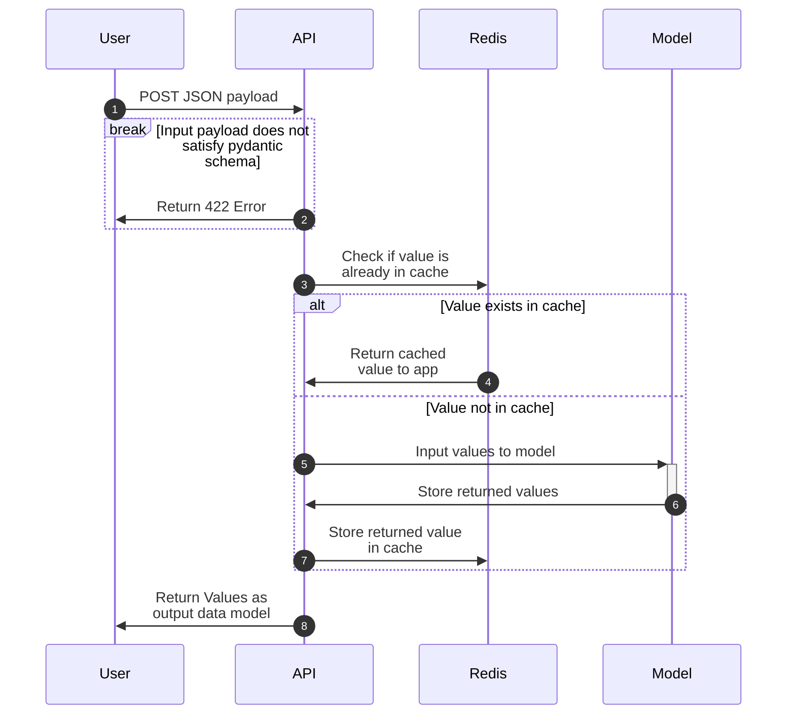

# Spring 2023 Capstone Team SimpLAWfy

## Team Members
Shehzad Shahbuddin  
Allie Ayrapetyan  
Giovanni Mola  
Rohit Bakshi  
Marque Green  

### Sequence Diagram

```mermaid
sequenceDiagram
    autonumber
    participant U as User
    participant A as API
    participant R as Redis
    participant M as Model

    U ->> A: POST JSON payload
    break Input payload does not satisfy pydantic schema
        A ->> U: Return 422 Error
    end
    A ->> R: Check if value is<br>already in cache
    alt Value exists in cache
        R ->> A: Return cached<br>value to app
    else Value not in cache
        A ->>+ M: Input values to model
        M ->>- A: Store returned values
        A ->> R: Store returned value<br>in cache
    end

    A ->> U: Return Values as<br>output data model
```
